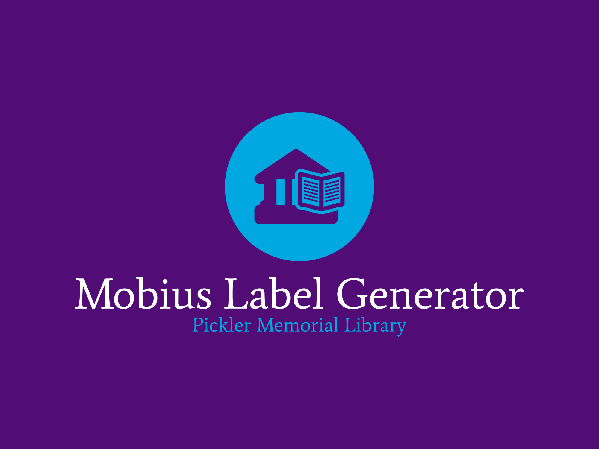
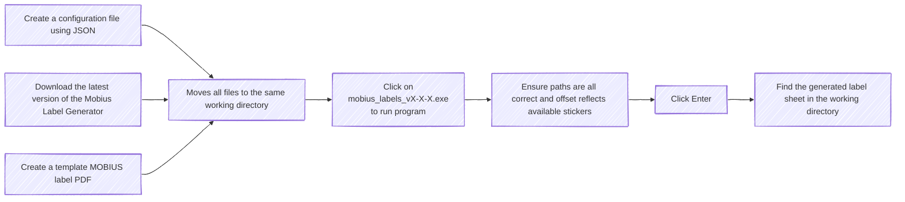

# User Manual - Mobius Label Generator

    

Welcome to the User Manual of Mobius Label Generator. This document aims to
help guide an end-user in the daily or regular use of this tool.

If you have any questions, comments, or concerns, plese feel free to reach
out to the [Justin Caringal](https://github.com/jaq-lagnirac), the lead
developer at the time of writing, or the current maintainers of this project.

## Table of Contents

1. [Purpose](#purpose)
1. [General Workflow](#general-workflow)
1. [Template PDF](#template-pdf)
1. [Configuration File](#configuration-file)
1. [Offsets](#offsets)
1. [Temporary Working Sub-Directory](#temporary-working-sub-directory)
1. [Output Label Sheet](#output-label-sheet)
1. [Credits and Closing](#credits-and-closing)
1. [Timestamp Details](#timestamp-details)

## Purpose

This program is intended as an open source generator to create labels to help 
facilitate interlibrary loans within the MOBIUS Linking Libraries Consortium.
The tool takes a template PDF given by the user (created using an external
tool&mdash;such as
[LibreOffice Writer](https://www.libreoffice.org/discover/writer/)&mdash;with
standard 8.5"x11" landscape letter dimensions) and generates a label sheet PDF
for use and printing on a standard 8.5"x11" portrait letter 4x2 sticker sheet.

## General Workflow

Below is the expected general workflow of a typical end-user wanting the
generate labels regularly. This workflow encompasses most if not all
functionalities currently present within the program.

## Template PDF

The tool requires a user-inputted PDF (relative or absolute) path. The default
name of the file is "mobius_label.pdf", stored in the same working directory
as the tool. This path can be changed with the relevant field. At minimum,
the PDF must have the following fields (labeled using an external tool):
- `Title` : The title of the piece of medium, FOLIO includes the author
    in this field on occasion.
- `CallNumber` : The call number of the item.
- `SendTo` : The intended destination of the item.
- `Patron` : If the request comes from the Home Libary listed in the
    config.json file (See [Configuration File](#configuration-file)),
    the requester's last and first name are displayed. Otherwise, the DcbSystem
    barcode is printed.
- `Location` : The shelving location of the requested item.

**Please note:** The generator is case-sensitive&mdash;the keys must be exact.
Please visit the repository for an example mobius_label.pdf as well as an
editable template DOCX.

## Configuration File

The tool requires a configuration file stored in the Javascript Object Notation
format (JSON). The default name of the file is "config.json", stored in the
same working directory as the tool. This path can be changed with the relevant
field. At minimum, the JSON must have the following keys and values:
- `okapi_url` : The URL to the OKAPI gateway to the FOLIO project,
    will most likely be `https://okapi-mobius.folio.ebsco.com`.
- `tenant` : The tenant ID for the institution.
- `username` : The individual user of the institution.
- `password` : The password for the associated account.

**Please note:** The generator is case-sensitive&mdash;the keys must be exact.
Please visit the repository for an editable template config.json file.

## Offsets

The tool is capable on printing a full sheet of 8 labels as well as printing on
used sheets (i.e. sheets that do not have a full 8 stickers) by using the
"offset" field. A small graphic appears on the main window to aid in 
determining the offset that will be inputted into the program, where X denotes
the labels that will be printed based on a vertical orientation (with blanks
denoting no label will be printed there).

## Temporary Working Sub-Directory

You may see a directory/folder named `.tmp_mobius_labels_jaq/` appear and
disappear during code execution and label generation. This is intended
behavior, and is a requirement for successful code execution. This directory
is the location where the tool conducts its operations in order to prevent
accessing files outside the scope of the program. You ***must*** have the extra
storage space in order for successful program execution. Do ***NOT*** interact
or attempt to delete this directory during runtime execution, as this may lead
to erroneous behavior.

## Output Label Sheet

After clicking `Enter`, wait until a green status message appears on the main
window. After a successful generation, you will find a label sheet named
`YYYYMMDD_HHMMSS_label_sheet.pdf` in an output directory named
`MOBIUS_LABEL_OUTPUT_JAQ`. The file's prefix is generated using a modified
[ISO 8601 Basic](https://en.wikipedia.org/wiki/ISO_8601) format denoting the 
time of creation. If the output sub-directory does not exist in the working
directory, one will be created; in other words, you do not need to create the
output directory manually.

## Credits and Closing

Developed for use and further development on Windows using Python 3.12+.

This tool was commissioned by Stephen Wynn, the Associate Dean of Libraries for
Technical Services & Systems of
[Pickler Memorial Library](https://library.truman.edu/) at
[Truman State University](https://www.truman.edu/). Developed by
[Justin Caringal](https://jaq-lagnirac.github.io/), BSCS Class of 2025,
of [Truman State University](https://www.truman.edu/).

## Timestamp Details

- **USERMANUAL.md originally published:** 2024-10-09, Project v2.0.0
- **USERMANUAL.md last updated:** 2024-10-21, Project v2.2.0
- **USERMANUAL.md version:** v1.4